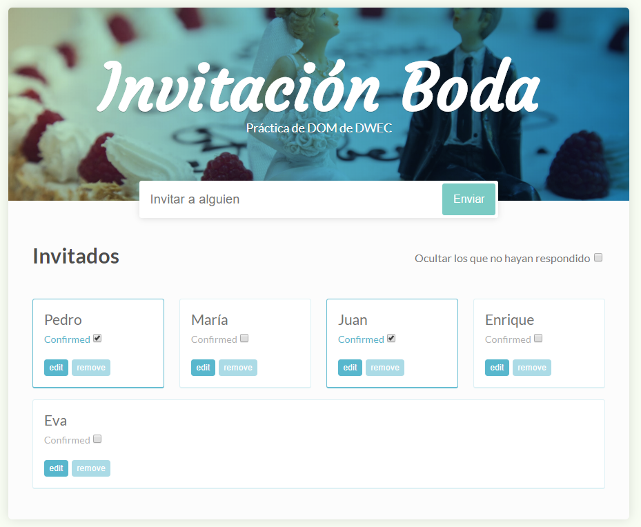

# Invitación Boda

Aplicación de invitación boda.

El objetivo es desarrollar una aplicación para controlar las invitaciones a una boda, que tendrá un aspecto final como el de la imagen

Puedes moficiar el contexto a otro que quieras, un partido de futbol, una lan party para jugar partidas en red con amigos, etc. 
pero la funcionad pedida será la misma y debes respetar los nombres de las clases css

La estructura básica html y css ya está creada, pero eres libre para modificarla si así lo deseas.

Completa todas las historias utilizando DOM

1) Cómo Administrador del evento, querría añadir nombres a la lista de invitados para saber quien asistirá.
1) Cómo Administrador del evento, querría poder confirmar invitados al evento para saber quien finalmente irá
1) Cómo Administrador del evento poder editar el nombre de cada asistente al evento para corregir errores
1) Cómo Administrador del evento querría poder filtrar los invitados para mostrar solo los que tienen confirmada la asistencia para visualizarlo mejor
1) Cómo Administrador del evento, querría poder eliminar invitados al evento que se hayan dado de baja
1) Cómo Administrador del evento me confirme antes de borrar un invitado al evento para evitar cometer un error
1) Cómo Administrador del evento querría que no se pudiera repetir el nombre de un invitado al evento ni añadir nombres vacios para evitar errores

